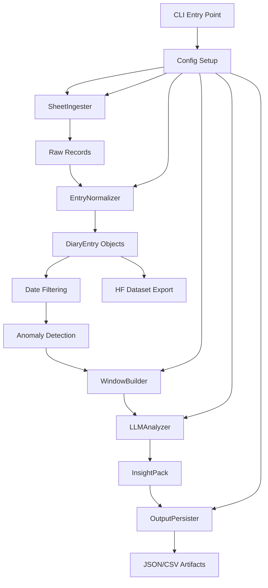

# Python Class Diagram - San-Xing Insight Engine

## Overview

This document provides a class diagram for the Python insight engine (`src/` directory) of the San-Xing project. The system follows a pipeline architecture processing diary entries from Google Sheets through normalization, windowing, LLM analysis, and persistence.

## Class Diagram

```mermaid
classDiagram
    class Config {
        +str SPREADSHEET_ID
        +Path CREDENTIALS_PATH
        +str TAB_NAME
        +int MIN_DIARY_LENGTH
        +int EARLY_MORNING_HOUR
        +str LLM_MODEL
        +int LLM_TIMEOUT
        +int LLM_MAX_RETRIES
        +bool LLM_STREAM
        +Path OUTPUT_DIR
        +Path RAW_DIR
        +Path INSIGHTS_DIR
        +Dict VERSION
        +validate() void
        +to_dict() Dict
        +from_file(path: Path, overrides: Dict) Config
    }

    class DiaryEntry {
        +str raw_timestamp
        +datetime timestamp
        +int ts_epoch
        +date logical_date
        +str diary_text
        +int entry_length
        +str entry_id
        +bool is_early_morning
        +from_raw(raw_timestamp: str, diary_text: str, parsed_dt: datetime) DiaryEntry
    }

    class DailySummary {
        +str date
        +str summary
    }

    class Theme {
        +str label
        +int support
    }

    class InsightPack {
        +Dict meta
        +List~DailySummary~ dailySummaries
        +List~Theme~ themes
        +str reflectiveQuestion
        +List~str~ anomalies
        +List~str~ hiddenSignals
        +List~Dict~ emotionalIndicators
        +to_json() str
        +to_dict() Dict
        +create_fallback(run_id: str, version: Dict, entries_count: int) InsightPack
    }

    class SheetIngester {
        -Config config
        -gspread.Client client
        +__init__(config: Config)
        +connect() void
        +fetch_rows() Tuple~List~Dict~, str~
        +validate_headers(records: List~Dict~) bool
        -_save_snapshot(records: List~Dict~) void
        -_make_headers_unique(headers: List~str~) List~str~
    }

    class EntryNormalizer {
        -Config config
        +__init__(config: Config)
        +normalize(records: List~dict~) List~DiaryEntry~
        +detect_anomalies(entries: List~DiaryEntry~) List~str~
        -_process_record(record: dict) DiaryEntry?
        -_parse_timestamp(raw: str) datetime?
    }

    class WindowBuilder {
        -Config config
        +__init__(config: Config)
        +build_window(entries: List~DiaryEntry~, char_budget: int) Tuple~List~DiaryEntry~, int~
    }

    class LLMAnalyzer {
        -Config config
        +__init__(config: Config)
        +analyze(entries: List~DiaryEntry~, run_id: str) InsightPack
        -_build_prompt(entries: List~DiaryEntry~) str
        -_call_llm(prompt: str) Dict
        -_parse_response(data: Dict, run_id: str, entries_count: int) InsightPack
        -_create_empty_pack(run_id: str) InsightPack
    }

    class OutputPersister {
        -Config config
        +__init__(config: Config)
        +persist(pack: InsightPack, run_id: str) Path
        +save_entries_snapshot(entries: List~DiaryEntry~, run_id: str) void
        -_write_theme_csv(pack: InsightPack) void
    }

    class JSONFormatter {
        +format(record: logging.LogRecord) str
    }

    %% CLI and Utilities
    class CLI {
        +main() void
        -cfg_get(*keys, default) Any
    }

    %% Utility Functions
    class HFExport {
        +export_hf_dataset(entries: List~DiaryEntry~, out_dir: Path) Path
    }

    class Logger {
        +get_logger(name: str) logging.Logger
    }

    %% Relationships
    SheetIngester --> Config : uses
    EntryNormalizer --> Config : uses
    EntryNormalizer --> DiaryEntry : creates
    WindowBuilder --> Config : uses
    WindowBuilder --> DiaryEntry : processes
    LLMAnalyzer --> Config : uses
    LLMAnalyzer --> DiaryEntry : processes
    LLMAnalyzer --> InsightPack : creates
    OutputPersister --> Config : uses
    OutputPersister --> InsightPack : persists
    OutputPersister --> DiaryEntry : saves snapshots
    
    InsightPack --> DailySummary : contains
    InsightPack --> Theme : contains
    
    CLI --> Config : configures
    CLI --> SheetIngester : orchestrates
    CLI --> EntryNormalizer : orchestrates  
    CLI --> WindowBuilder : orchestrates
    CLI --> LLMAnalyzer : orchestrates
    CLI --> OutputPersister : orchestrates
    CLI --> HFExport : optional export
    
    Logger --> JSONFormatter : uses
```

## Processing Pipeline Flow

## Key Class Relationships

### Data Flow Architecture
1. **Config** - Central configuration singleton used by all processing classes
2. **SheetIngester** → **EntryNormalizer** → **WindowBuilder** → **LLMAnalyzer** → **OutputPersister** (main pipeline)
3. **DiaryEntry** - Core data model passed between processing stages
4. **InsightPack** - Final analysis output containing structured insights

### Data Models
- **DiaryEntry**: Normalized diary entry with computed logical dates and early morning detection
- **InsightPack**: Complete analysis output with themes, summaries, and reflective questions  
- **DailySummary** & **Theme**: Component data structures within InsightPack

### Processing Classes
- **SheetIngester**: Google Sheets API integration with caching and error handling
- **EntryNormalizer**: Timestamp parsing, filtering, and anomaly detection
- **WindowBuilder**: Character budget management for LLM context optimization
- **LLMAnalyzer**: Traditional Chinese prompt construction and LLM API calls
- **OutputPersister**: JSON and CSV artifact generation

### Utility Classes
- **JSONFormatter**: Structured logging with run_id tracking
- **HFExport**: Optional HuggingFace dataset export functionality
- **CLI**: Main orchestrator with configuration precedence handling

## Key Design Patterns

### Configuration Pattern
All processing classes accept a `Config` instance in their constructor, providing centralized configuration management with environment variable and file overrides.

### Factory/Builder Pattern
- `DiaryEntry.from_raw()` - Factory method for creating entries with computed fields
- `InsightPack.create_fallback()` - Factory for fallback instances when LLM fails

### Pipeline Pattern
The main processing flow follows a strict pipeline where each stage processes the output of the previous stage, enabling clear separation of concerns and testability.

### Dependency Injection
All classes receive their dependencies (primarily `Config`) through constructor injection, facilitating testing and configuration flexibility.

## Error Handling Strategy

### Graceful Degradation
- LLM failures result in fallback `InsightPack` instances rather than complete failure
- Missing optional dependencies (like `datasets` for HF export) are handled gracefully
- Malformed data is filtered out rather than causing pipeline failure

### Exit Code Strategy
- 0: Success
- 10: Configuration/validation errors  
- 20: No valid entries after filtering
- 30: Fallback mode (LLM failed but artifacts produced)
- 1: Runtime errors
- 130: User interruption

This architecture ensures robust processing of personal diary data with clear error boundaries and graceful failure modes.